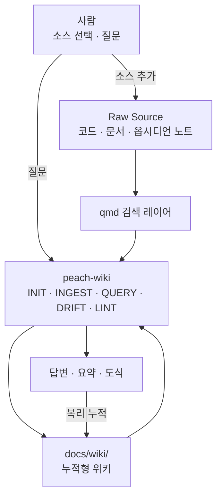
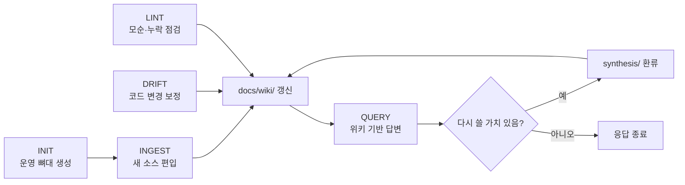
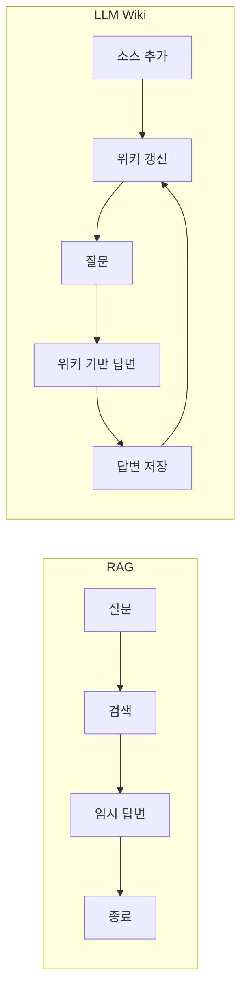

# LLM Wiki 시스템 구성도

> 초기 구조 설명 문서를 바탕으로, 현재 `peach-wiki` 최종 구조에 맞춰 다시 정리한 설명 문서다.
> 관련 문서: [패턴 분석](03-LLM위키-패턴-분석.md), [qmd 가이드](04-qmd-설치-활용-가이드.md), [종합 분석](05-qmd와-LLM위키-종합분석.md)

## 30초 요약

`peach-wiki`는 Raw Source를 직접 답변에 재조합하는 대신, `docs/wiki/`에 누적형 위키를 만들고 계속 갱신하는 구조다.

- 이 시스템의 핵심은 검색이 아니라 누적이다.
- 질문은 소비가 아니라, 다시 지식을 쌓는 입력이다.
- `docs/wiki/`는 결과 저장소가 아니라, 다음 질문의 출발점이다.

## 1. 전체 시스템 구성도

### 핵심 해설

- 이 그림은 "소스를 읽고, 위키로 쌓고, 그 위키로 답하는" 흐름만 보여준다.
- qmd는 검색 레이어이고, 실제 누적 지식은 `docs/wiki/`에 저장된다.
- 답변과 요약이 다시 위키를 강화하는 구조라서, 사용할수록 위키의 밀도가 올라간다.

## 2. 오퍼레이션 흐름도

### 핵심 해설

- `INIT`는 운영 뼈대를 만드는 단계다.
- `INGEST`는 새 소스를 위키 구조에 편입시키는 단계다.
- `QUERY`는 위키를 먼저 읽고, 가치 있는 답변은 다시 `synthesis/`로 환류한다.
- `DRIFT`는 code 모드에서만 동작하며 코드 변화가 있을 때 위키를 다시 맞추는 보정 장치다.
- `LINT`는 빠진 링크, 모순, 고아 문서를 점검하는 품질 유지 단계다.

## 3. 용어를 짧게 읽기

- `INIT`: 처음 한 번만 만드는 운영 뼈대
- `INGEST`: 새 소스를 `docs/wiki/` 구조에 편입
- `QUERY`: 위키를 먼저 읽고 답변 생성
- `DRIFT`: 코드 변경을 위키에 반영하는 보정
- `LINT`: 모순, 누락, 고아 페이지를 점검

`docs/wiki/` 안에는 `WIKI-AGENTS.md`, `wiki-index.md`, `wiki-log.md`, `concepts/`, `entities/`, `synthesis/`, `sources/`, `diagrams/`가 들어간다. 다만 이 문서의 목적은 저장소 목록 나열이 아니라 흐름 이해이므로, 도식에서는 한 덩어리로 묶어 보여준다.

## 4. RAG와 LLM Wiki 비교

### 핵심 해설

- RAG는 답변이 끝나면 구조적 자산이 남지 않는다.
- LLM Wiki는 `INGEST`와 `QUERY` 모두 위키를 강화한다.
- 이 누적성이 `peach-wiki`의 핵심 차별점이다.

## 무엇이 이전 실험 구조와 달라졌나

- `5-Wiki`, `.wiki/` 같은 과거 저장 위치 설명을 제거했다.
- `wiki-para`, `wiki-code` 이원화 대신 단일 `peach-wiki` 기준으로 통합했다.
- 현재 운영 기준인 `docs/wiki/`, `INIT/INGEST/QUERY/DRIFT/LINT`, qmd 우선 검색 원칙을 반영했다.

## 연결 문서

- [LLM Wiki 원문](02-LLM위키-원문.md)
- [LLM Wiki 패턴 분석](03-LLM위키-패턴-분석.md)
- [qmd 설치·활용 가이드](04-qmd-설치-활용-가이드.md)
- [qmd와 LLM Wiki 종합 분석](05-qmd와-LLM위키-종합분석.md)
